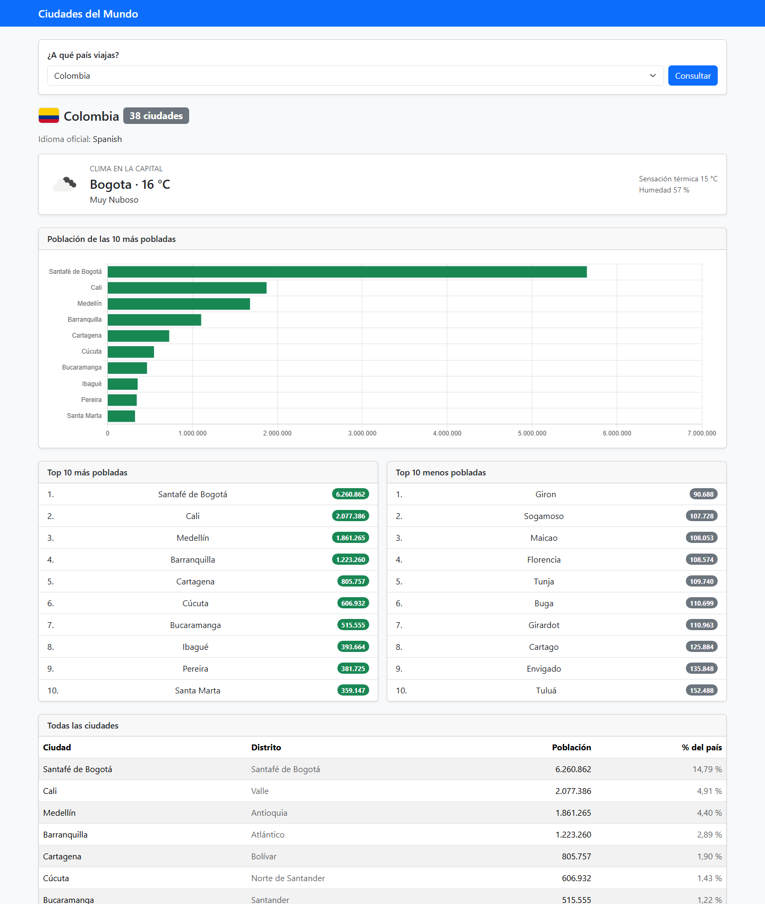
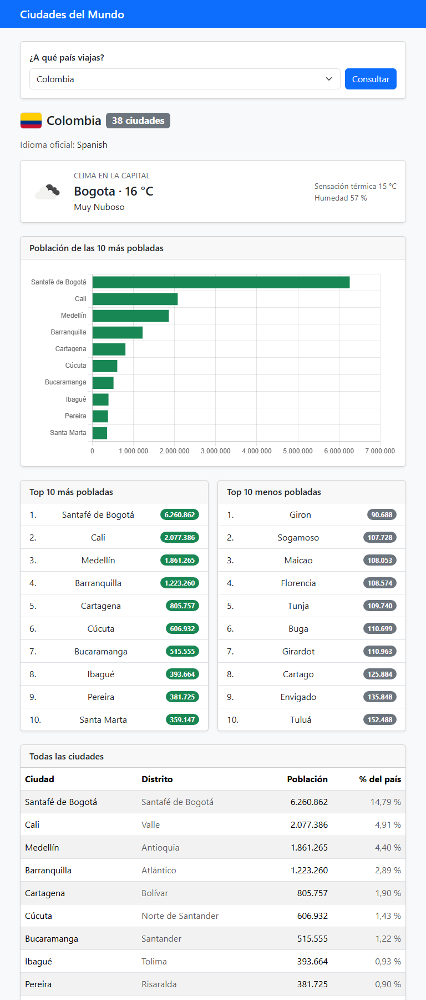
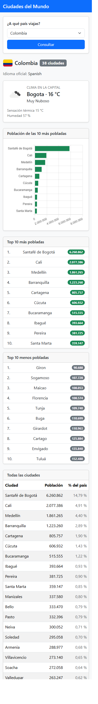

# Ciudades del Mundo

Aplicación web que permite consultar, para cualquier país, sus ciudades y la población de cada
una, destacando las **10 más pobladas** y las **10 menos pobladas**.

Desarrollada como prueba técnica para el cargo de **Analista de Soporte Nivel 1** en
INFODEC S.A.S.

---

## El problema que resuelve

Sofía Restrepo viaja con frecuencia y quiere saber, según el país al que va, cuáles son sus
ciudades más y menos pobladas. Necesita consultarlo desde el computador, la tablet o el teléfono.

La aplicación es **una sola pantalla** donde se elige un país y se obtiene:

- El listado completo de sus ciudades, con la población de cada una y el porcentaje que
  representa sobre la población del país
- El top 10 de las más pobladas y el de las menos pobladas
- Un gráfico de barras del top 10
- La bandera del país y sus idiomas oficiales
- El clima actual de su capital

## Capturas

| Escritorio (1440 px) |
|---|
|  |

| Tablet (768 px) | Móvil (375 px) |
|---|---|
|  |  |

En móvil el formulario se apila, los dos top 10 pasan a una columna y la columna *Distrito* se
oculta para dejarle el ancho a lo que importa.

---

## Requisitos previos

| Requisito | Versión usada | Mínimo |
|---|---|---|
| PHP | 8.4 | 8.2 |
| Composer | 2.10 | 2.x |
| MySQL o MariaDB | MariaDB 10.4 | MySQL 5.7 |

Extensiones de PHP necesarias: `pdo_mysql`, `mbstring`, `openssl`, `curl`, `fileinfo`, `tokenizer`,
`xml`, `ctype`. Casi todas vienen activadas de fábrica; `pdo_mysql` y `curl` a veces no.

**No se necesita Node ni npm.** La interfaz usa Bootstrap y Chart.js por CDN.

---

## Instalación

### 1. Clonar e instalar dependencias

```bash
git clone https://github.com/DemoCam/prueba-tecnica-infodec.git
cd prueba-tecnica-infodec

composer install
```

### 2. Importar la base de datos

El dump viene incluido en el repositorio:

```bash
mysql -u root -p < database/world.sql
```

El script ya contiene `CREATE DATABASE world`, así que no hace falta crearla antes. En Windows, si
`mysql` no está en el PATH, invócalo por ruta completa:

```bash
C:\xampp\mysql\bin\mysql.exe -u root < database/world.sql
```

También se puede importar desde phpMyAdmin, DBeaver, HeidiSQL o MySQL Workbench abriendo el
archivo y ejecutándolo.

**Verifica que quedó completa:**

```sql
SELECT
    (SELECT COUNT(*) FROM country)         AS paises,
    (SELECT COUNT(*) FROM city)            AS ciudades,
    (SELECT COUNT(*) FROM countrylanguage) AS idiomas;
```

Debe dar `239`, `4079` y `984`. Si alguno da menos, la importación quedó incompleta.

Más detalles en [`database/README.md`](database/README.md).

### 3. Configurar el entorno

```bash
cp .env.example .env
php artisan key:generate
```

Edita el `.env` con los datos de tu servidor:

```env
DB_CONNECTION=mysql
DB_HOST=127.0.0.1
DB_PORT=3306
DB_DATABASE=world
DB_USERNAME=root
DB_PASSWORD=
```

> **No ejecutes `php artisan migrate`.** La aplicación solo lee de `world` y no necesita ninguna
> tabla propia. El `.env.example` viene con `SESSION_DRIVER=file` y `CACHE_STORE=file` justamente
> para que Laravel no cree sus tablas internas dentro de la base de la prueba.

### 4. Obtener la API key del clima

1. Crea una cuenta gratuita en [openweathermap.org](https://openweathermap.org/api).
2. Confirma el correo de verificación.
3. Entra a **My API keys** y copia la key.
4. Pégala en el `.env`:

```env
OPENWEATHER_API_KEY=tu_key_aqui
```

> ⚠️ **Una key recién creada no funciona de inmediato.** OpenWeather tarda entre 10 minutos y
> ~2 horas en activarla, y mientras tanto responde `401 Invalid API key`. No es un error de
> configuración: hay que esperar. Ver [Troubleshooting](#la-api-devuelve-401-invalid-api-key).

La aplicación **funciona sin la key**: muestra un aviso donde iría el clima y el resto de la
pantalla opera con normalidad.

### 5. Levantar la aplicación

```bash
php artisan serve
```

Queda disponible en <http://localhost:8000>.

---

## Troubleshooting

Los problemas que aparecieron realmente durante el desarrollo, con su diagnóstico y su solución.

### `cURL error 60: SSL certificate ... unable to get local issuer certificate`

**Síntoma:** la aplicación devuelve error 500 en cualquier país que tenga capital. Todo lo demás
funciona.

**Causa:** PHP en Windows no trae un bundle de certificados CA configurado, así que **toda llamada
HTTPS falla**. Es fácil de diagnosticar mal, porque las mismas peticiones desde PowerShell o el
navegador sí funcionan: esas usan el almacén de certificados de Windows, y PHP usa el suyo propio.

**Solución:**

1. Descarga [https://curl.se/ca/cacert.pem](https://curl.se/ca/cacert.pem)
2. Guárdalo, por ejemplo, en `C:\php\extras\ssl\cacert.pem`
3. En tu `php.ini`, apunta las dos directivas al archivo:

```ini
curl.cainfo = "C:\php\extras\ssl\cacert.pem"
openssl.cafile = "C:\php\extras\ssl\cacert.pem"
```

4. Reinicia el servidor. Comprueba con `php -i | findstr cainfo`.

### La API devuelve `401 Invalid API key`

**Síntoma:** el clima muestra *"No se pudo consultar el servicio meteorológico"*, y en
`storage/logs/laravel.log` aparece `HTTP 401`.

**Causa más probable:** la key es nueva y todavía no está activa. Se comprobó durante el
desarrollo: la misma key dio 401 y, minutos después **sin cambiar nada**, respondió 200. Una key
creada en ese mismo momento seguía dando 401, lo que descarta un error de digitación.

**Solución:** esperar. Puede tardar hasta ~2 horas. Verifica con una petición mínima:

```bash
curl "https://api.openweathermap.org/data/2.5/weather?q=Lima&appid=TU_KEY"
```

Si después de dos horas sigue en 401, revisa que hayas confirmado el correo de la cuenta y que la
key esté marcada como activa en el panel de OpenWeather.

### `SQLSTATE[42S02]: Table 'world.sessions' doesn't exist`

**Causa:** el `.env` tiene `SESSION_DRIVER=database` o `CACHE_STORE=database`. Laravel intenta
guardar sesiones y caché en tablas SQL dentro de `world`.

**Solución:** ponerlos en `file`, como viene en `.env.example`.

```env
SESSION_DRIVER=file
CACHE_STORE=file
```

**No lo resuelvas con `php artisan migrate`**: eso crearía nueve tablas de Laravel dentro de la
base de la prueba, mezcladas con `country`, `city` y `countrylanguage`.

### `SQLSTATE[HY000] [1049] Unknown database 'world'`

La base no está importada, o tiene otro nombre. Verifica con `SHOW DATABASES;` y revisa el paso 2.

### `Class "PDO" not found` o `could not find driver`

Falta la extensión `pdo_mysql`. Actívala en `php.ini` quitando el `;` inicial:

```ini
extension=pdo_mysql
```

### El clima de un país concreto nunca aparece

Es esperable en cuatro países. La base `world` es de alrededor del año 2000 y guarda nombres de
capital que el servicio meteorológico ya no reconoce. La aplicación corrige los casos frecuentes,
pero `N´Djaména` (Chad), `Fakaofo` (Tokelau), `Garapan` (Islas Marianas) y `Dalap-Uliga-Darrit`
(Islas Marshall) no están en el catálogo de OpenWeather.

El detalle completo está en
[la documentación técnica](docs/documentacion-tecnica.md#nombres-de-capital-que-el-dataset-trae-desactualizados).

### Cambié algo en `.env` y no surte efecto

Laravel cachea la configuración:

```bash
php artisan config:clear
php artisan cache:clear
```

---

## Origen de los datos

La base de ejemplo **`world` de MySQL**.

> El archivo `world.sql` que las notas de la prueba mencionan como *"compartido"* **no venía
> adjunto** en el correo. Se descargó desde la fuente oficial de MySQL.

- Página oficial: <https://dev.mysql.com/doc/index-other.html> → *Example Databases* → *world database*
- Descarga directa: <https://downloads.mysql.com/docs/world-db.zip>

Se versiona dentro del repositorio en `database/world.sql` para que el proyecto sea reproducible
sin depender de una descarga externa. Son 398 KB de datos estáticos que nunca cambian.

**Los datos corresponden aproximadamente al año 2000.** La base todavía incluye países que ya no
existen, como Yugoslavia o las Antillas Neerlandesas. Es la base que el enunciado indicó usar.

---

## Stack

- **Laravel 12** sobre PHP 8.4, con el patrón MVC
- **MySQL / MariaDB** con la base `world`
- **Bootstrap 5** por CDN, sin pipeline de build
- **Chart.js** por CDN para el gráfico del top 10
- **OpenWeatherMap** para el clima de la capital
- **Laravel Pint** para el estilo de código (PSR-12)

---

## Documentación

| Documento | Contenido |
|---|---|
| [Documentación técnica](docs/documentacion-tecnica.md) | Arquitectura, modelo de datos, decisiones técnicas, integración con la API y limitaciones conocidas |
| [Diagrama entidad-relación](docs/diagrama-er.png) | Las tres tablas, sus columnas y las relaciones entre ellas |
| [Colección de Postman](docs/postman/) | Las siete peticiones al servicio de clima y al de divisas, con las capturas de su ejecución |
| [Base de datos](database/README.md) | Importación del dump y verificación |

El **diagrama entidad-relación**, las **consultas SQL de la Pregunta 2** y las **respuestas a las
Preguntas 3 y 5** se entregan en el documento adjunto al correo, junto con la evidencia de
ejecución de cada consulta y la colección de Postman.
